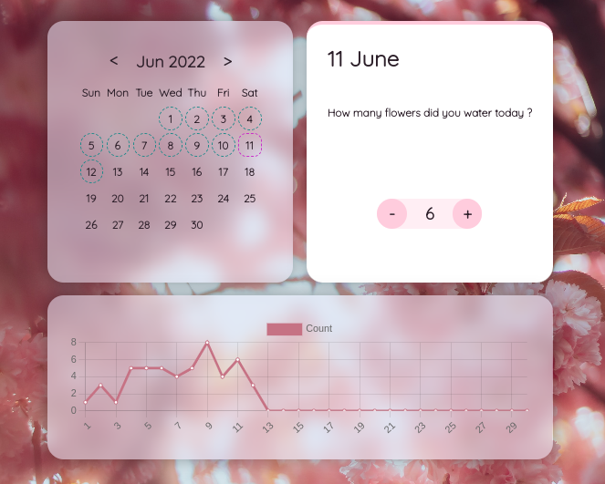

# PlantWateringTracker 
[](https://github.com/IrisTheSnail/PlantWateringTracker/actions/workflows/ci.yml)

> PlantWateringTracker is a simple React app that helps you keep track of your plant watering schedule. It features an interactive calendar where you can log watering dates

<div align="center">
  
</div>

## Prerequisites
- NodeJS 18
- NPM 9
## How to run?
Start by installing dependencies by running
```sh
$ npm install
```
then start the app using
```sh
$ npm start
```
or build using 
```sh
$ npm build
```

# LICENSE
[MIT License - Copyright (c) 2022 IrisTheSnail](LICENSE.MD)
